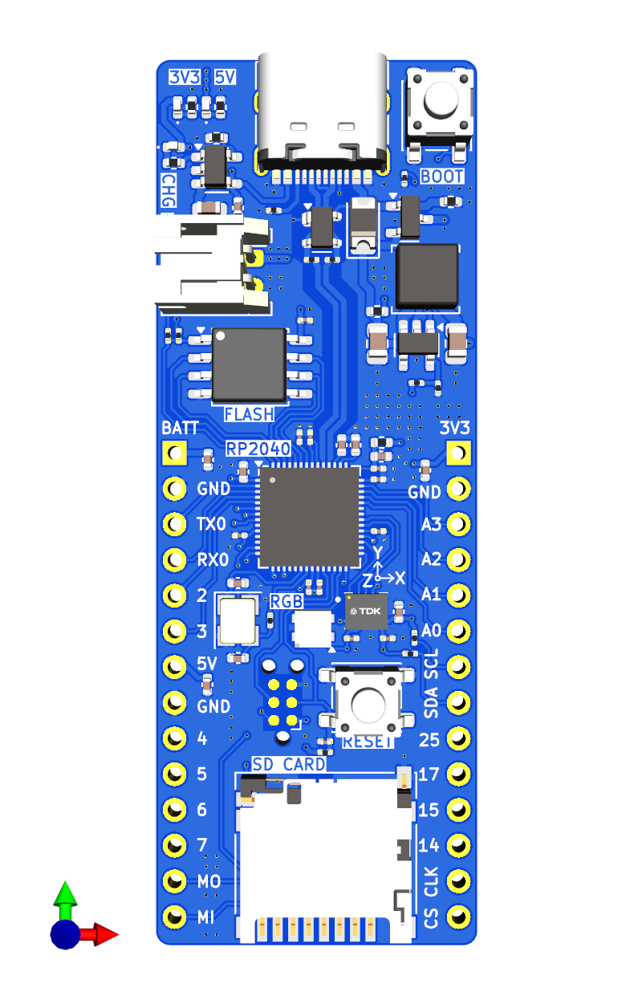
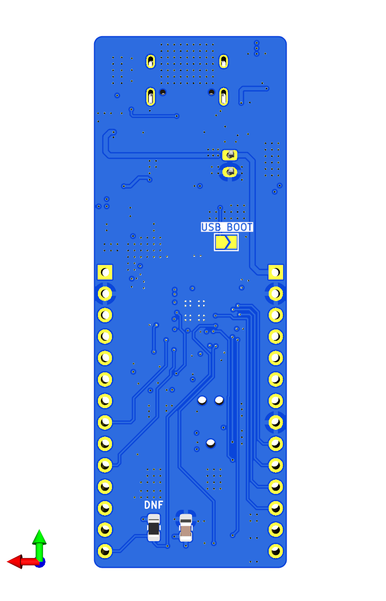
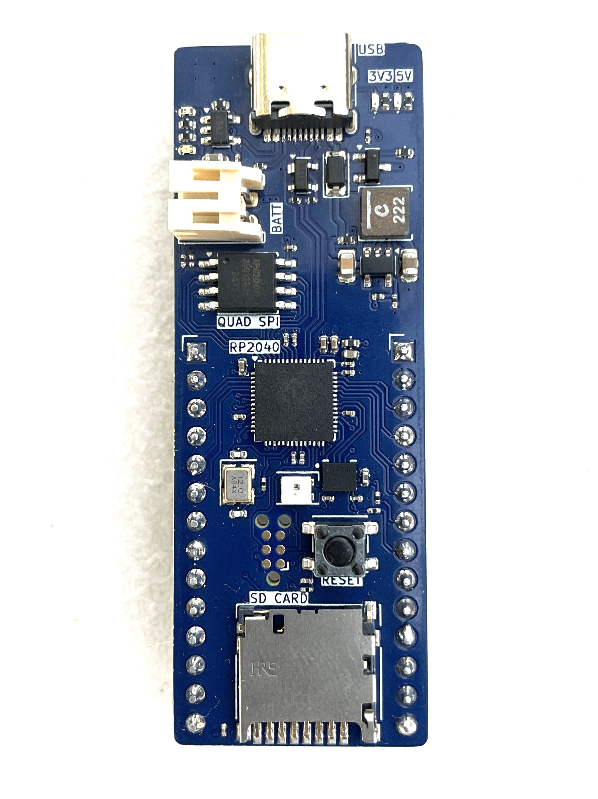
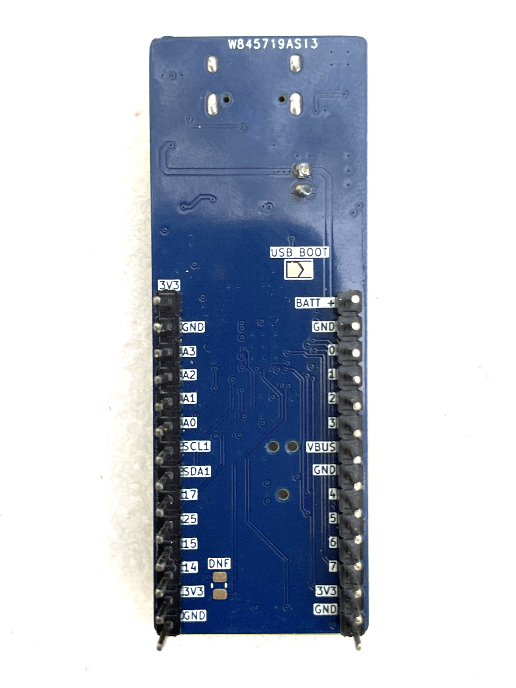
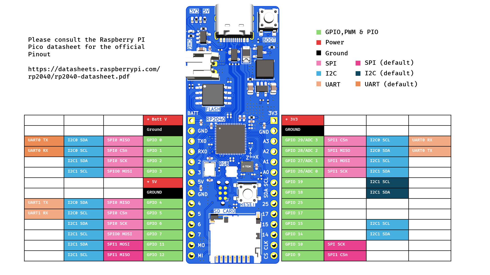

# RP2040 Motion Logger

  

    
    
  

  

    
    
  

*I have slightly modified the board to include a bootloader button and made some aesthetic changes. Thus, the produced board slightly looks different. Everything else remains the same*

## Order this Board Through [PCBway](https://www.pcbway.com) 🛫

You can order this board through PCBway for excellent board quality and fast shipping at a very affordable rate. 

- Using PCBway as the manufacturer is recommended because the stackup for this board is based on their specifications. The differential impedance for the USB differential pair has been calculated based on PCBway’s stackup, ensuring that the board will perform as intended when manufactured with them.

- The Bill of Materials (BOM) provided is in PCBway's format. This compatibility ensures a smooth and reliable production experience, reducing the chances of delays due to part sourcing.

To order, simply upload the zip file to PCBway’s portal, select your preferences,
set the Min Track/spacing to 6/6 mil and set the min hole size to 0.2mm. Choosing Immersion Gold(ENIG) as the board finish is recommended but not required, and place your order. PCBway’s user-friendly interface allows for easy customization and order tracking from manufacturing to delivery.

You can learn more about PCBway at the end.

## Interactive PCB Viewer

You can view this board interactively on [KiCanvas](https://kicanvas.org/?github=https%3A%2F%2Fgithub.com%2Frishikesh2715%2FRP2040_Motion_Logger).

## Overview
The RP2040 Motion Logger is a custom microcontroller board based on the RP2040 chip, designed for motion data logging and versatile IoT applications. This compact board (0.9 x 2.48 inches) integrates a wide range of features, making it a powerful tool for projects requiring motion sensing, storage, and connectivity.

### Key Features:
- **Microcontroller**: RP2040 with dual ARM Cortex M0+ processors
- **Motion Sensor**: ICM-42688-P IMU for 6-axis motion tracking
- **Storage**: 128 Mbit Quad SPI Flash Memory and SD Card connector
- **Power Options**: USB Type-C connector or 1S LiPo/Li-ion battery
- **Battery Management**: Onboard charger for 1S LiPo/Li-ion batteries
- **LEDs**: Addressable RGB LED for user indications, plus power status LEDs for both 3.3V and 5V
- **Connectors**:
  - TC2030 JTAG Connector for programming and debugging
  - A set of pin headers including UART, I2C, SPI, ADC, and GPIO pins
- **Power Supply**: 3.3V buck converter supporting up to 2A current
- **Additional Features**: Reset and Bootloader buttons, ESD protection, USB Power, Battery Power, and 3.3V Power pins on headers

### Power Options:
The RP2040 Motion Logger can be powered either via the USB Type-C connector or a 1S LiPo/Li-ion battery. 

### Programming Options:
You can program the board through the USB Type-C connector or the TC2030 JTAG Connector.

## Getting Started
1. **Power Up**: Connect the board via USB Type-C or connect a 1S LiPo/Li-ion battery.
2. **Programming**: Use either the USB connection or JTAG connector with an appropriate debugger to flash your code. (I use VS Code with Raspberry PI PICO Extension)
3. **Bootloader Mode**: Hold down the Bootloader button while connecting the board to USB to enter bootloader mode.
4. **Data Logging**: Use the IMU and available storage to log motion data, or extend functionality via UART, I2C, SPI, and ADC pins.

## Hardware Pinout

*Note* In reality All the RP2040's GPIO Pins are capable of I2C, UART, SPI communications but I have intenionaly left some of the pins blank in the PINOUT diagram whenever I did not had a whole set of communication pins.

## PCBWay - PCB Manufacturing and Assembly

This project was proudly sponsored by **PCBWay**, a leading PCB manufacturer and assembler. They provided high-quality PCB manufacturing and assembly services, ensuring that the RP2040 Motion Logger board was produced to the highest standards. Here’s why PCBWay is a great choice for PCB production:

- **Exceptional Quality**: The PCBs produced by PCBWay have excellent build quality, with precise soldering and thorough assembly.
- **Fast Service**: PCBWay offers quick turnaround times, so your project can stay on track.
- **Comprehensive Services**: From prototyping to mass production, PCBWay provides services for all stages of PCB development, including multi-layer PCBs, advanced PCBs, flexible PCBs, and assembly services.
- **Affordable Pricing**: PCBWay offers competitive pricing without compromising quality.
  

If you’re looking for a reliable partner to bring your PCB projects to life, check out PCBWay [here](https://pcbway.com/g/lGOcWf). With their extensive capabilities and top-notch customer support, PCBWay is the ideal choice for makers, engineers, and businesses alike.

## License
This project is open-source, licensed under the MIT License. Feel free to modify and distribute as per the license terms.

## Contributing
Contributions are welcome! Please fork the repository, make your changes, and submit a pull request. 

